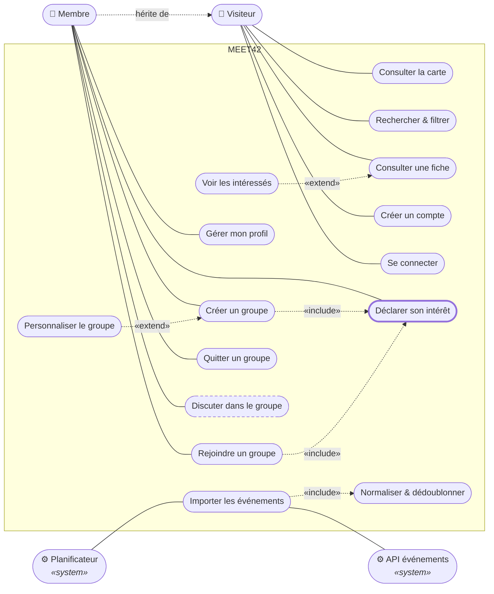

# Diagramme de cas d'utilisation — Meet42

Qui fait quoi dans Meet42. Deux acteurs humains, deux acteurs système, et les
quinze cas d'utilisation du périmètre P1 — avec les relations qui portent les
vraies règles du produit.

> Ce fichier remplace l'artefact `claude.ai`. Le diagramme UML d'origine est
> conservé en SVG à côté : [`cas-utilisation.svg`](cas-utilisation.svg) — c'est
> lui qu'il faut mettre dans le dossier d'analyse et dans les slides.
> Le schéma Mermaid ci-dessous est la version **éditable** : Mermaid n'a pas de
> diagramme de cas d'utilisation natif, c'est donc un graphe qui en reprend la
> structure, pas de l'UML strict.

---

## 1. Le diagramme

Le Membre hérite du Visiteur : tout ce qu'un visiteur peut faire, un membre le
peut aussi. **« Déclarer son intérêt » est le pivot du produit** — les deux
chemins qui mènent à un groupe passent obligatoirement par lui. « Discuter » est
en pointillé : c'est du P2, coupé.

---

## 2. Les acteurs

| Acteur | Nature | Rôle |
|---|---|---|
| **Visiteur** | Humain, principal | Non authentifié. Découvre les événements, consulte les fiches publiques. Ne peut ni participer ni rejoindre un groupe. |
| **Membre** | Humain, principal | Authentifié. Hérite de toutes les capacités du Visiteur et y ajoute la couche sociale. |
| **Planificateur** | Système, principal | Déclenche l'import périodique des événements. C'est lui l'acteur, pas l'administrateur — l'import tourne seul. |
| **API événements** | Système, secondaire | Fournit les données brutes. Sollicité par Meet42, ne déclenche jamais rien lui-même. |

---

## 3. Les cas d'utilisation

### Visiteur — découverte, accessible sans compte

| Cas d'utilisation | Priorité | Note |
|---|---|---|
| Consulter la carte | **P1** | Événements géolocalisés sur Bruxelles |
| Rechercher & filtrer | **P1** | Par date, catégorie, texte libre |
| Consulter une fiche | **P1** | Page publique indexable — l'entrée SEO |
| Voir les intéressés | **P1** | Extension optionnelle de la fiche |
| Créer un compte | **P1** | Fait basculer le Visiteur en Membre |
| Se connecter | **P1** | JWT |

### Membre — la couche sociale, compte requis

| Cas d'utilisation | Priorité | Note |
|---|---|---|
| Déclarer son intérêt | **P1** | « J'ai envie d'y aller » — le pivot du produit |
| Créer un groupe | **P1** | Inclut la déclaration d'intérêt |
| Personnaliser le groupe | **P1** | Extension : nom, point de RDV, taille |
| Rejoindre un groupe | **P1** | Inclut la déclaration d'intérêt |
| Quitter un groupe | **P1** | Sans justification, à tout moment |
| Gérer mon profil | **P1** | Bio, centres d'intérêt, **déconnexion** |
| Discuter dans le groupe | P2 | Coupé du périmètre d'un mois |

### Planificateur — ingestion automatique

| Cas d'utilisation | Priorité | Note |
|---|---|---|
| Importer les événements | **P1** | Appelle l'API externe |
| Normaliser & dédoublonner | **P1** | Toujours exécuté — d'où le `include` |

---

## 4. Include et extend

C'est là que se voit la compréhension d'UML. La règle : **include = toujours
exécuté**, **extend = parfois**. La flèche part toujours du cas qui dépend, vers
celui dont il dépend.

| Relation | Type | Pourquoi |
|---|---|---|
| Créer un groupe → Déclarer son intérêt | `include` | Ouvrir un groupe pour une sortie où l'on ne va pas n'a aucun sens. La déclaration est automatique, jamais optionnelle. |
| Rejoindre un groupe → Déclarer son intérêt | `include` | Même logique. Ces deux `include` expliquent pourquoi `participations` se remplit sans que l'utilisateur clique sur le cœur. |
| Importer → Normaliser & dédoublonner | `include` | Aucune donnée n'entre en base sans passer par la normalisation. C'est la contrainte `UNIQUE (source, external_id)` vue côté comportement. |
| Voir les intéressés → Consulter une fiche | `extend` | Comportement optionnel déclenché depuis la fiche. La fiche reste complète sans lui. |
| Personnaliser le groupe → Créer un groupe | `extend` | La création tient en un tap avec des valeurs par défaut ; la personnalisation est un détour facultatif. |

---

## 5. Les décisions de modélisation

**Pourquoi ne pas mettre « s'authentifier » en `include` partout ?**
C'est l'erreur la plus fréquente sur ce type de diagramme : dix flèches `include`
vers « s'authentifier » qui rendent le schéma illisible sans rien apprendre. La
généralisation **Membre → Visiteur** dit la même chose une seule fois : si un cas
est relié au Membre, il faut être connecté.

**Pourquoi le Planificateur est-il un acteur ?**
Parce qu'un acteur est *ce qui déclenche*, pas nécessairement quelqu'un. L'import
tourne seul, sans intervention humaine. Le poser en acteur rend cette
automatisation visible — et évite qu'on demande « mais qui importe les
événements ? ».

**Pourquoi l'API externe est-elle à droite ?**
Convention UML : acteurs principaux à gauche, acteurs secondaires à droite. L'API
ne déclenche rien, elle est sollicitée. Sa présence matérialise la dépendance
externe — c'est un point à montrer, pas à cacher.

**Pourquoi pas d'acteur Administrateur ?**
Il n'y a qu'un type d'utilisateur en P1. Si j'ajoute une saisie manuelle
d'événements comme plan B, j'ajoute un acteur Administrateur relié à « Saisir un
événement », et une colonne `role` sur `users`.

**Pourquoi « Discuter » est-il en pointillé ?**
C'est du P2, coupé pour tenir en un mois. Le laisser visible mais distinct montre
que j'ai *arbitré* plutôt qu'oublié. Un périmètre assumé s'explique, un trou se
subit.

---

## 6. Et après

Ce diagramme donne directement les tranches de développement : **un cas
d'utilisation P1 = une tranche verticale** (modèle, endpoint, écran, test),
exactement ce que demandent les consignes. Commencer par « Créer un compte » et
« Se connecter », finir par les groupes.

Puis reporter les quinze cas en cartes Trello : le troisième livrable d'analyse
est fait en dix minutes.
