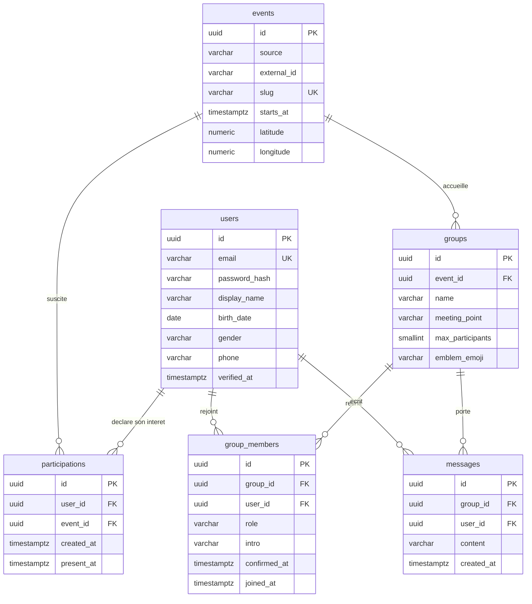

# Schéma entité / association — Meet42

Six tables, de l'ingestion des événements bruxellois jusqu'à la discussion de
groupe. Minimum requis par les consignes : 4.

Deux colonnes portent le produit lui-même : `intro` oblige à écrire une phrase
pour rejoindre un groupe — c'est ce qui fait que les gens se parlent — et
`present_at` signale une présence sans jamais révéler de position.

> Ce fichier remplace l'artefact `claude.ai`. Il est versionné, donc il se
> modifie en place quand le schéma évolue — pas de capture d'écran à refaire.
> GitHub rend le diagramme Mermaid automatiquement.

---

## 1. Vue d'ensemble

Deux entités indépendantes — `users` et `events` — et quatre tables qui les
relient. `participations` et `group_members` sont des tables d'association
classiques ; `groups` et `messages` portent leurs propres données en plus de la
relation.



---

## 2. Les tables en détail

### `users` — comptes et profils

| Colonne | Type | Rôle |
|---|---|---|
| **PK** `id` | `UUID` | Généré par la base (`gen_random_uuid()`) |
| **UQ** `email` | `VARCHAR(255)` | Identifiant de connexion, normalisé en minuscules |
| `password_hash` | `VARCHAR(60)` | Longueur exacte d'un hash bcrypt. Jamais le mot de passe en clair. |
| `display_name` | `VARCHAR(80)` | Prénom affiché dans les groupes |
| `birth_date` | `DATE` | L'âge se calcule, il ne se stocke pas |
| `bio` | `VARCHAR(280)` | Nullable |
| `avatar_url` | `TEXT` | Nullable |
| `district` | `VARCHAR(80)` | Commune bruxelloise, nullable |
| `gender` | `ENUM('femme','homme','autre')` | Déclaratif et **facultatif** — informer, pas filtrer |
| `phone` | `VARCHAR(20)` | Nullable — prépare la vérification SMS niveau 1 |
| `verified_at` | `TIMESTAMPTZ` | Nullable. Le badge se lit `verified_at IS NOT NULL` |
| `created_at` / `updated_at` | `TIMESTAMPTZ` | NOT NULL |

**Contraintes**
- `CHECK (birth_date > DATE '1900-01-01')` — plausibilité seulement
- La majorité (18 ans) est vérifiée **dans le contrôleur**, pas en base : elle dépend de la date du jour, et `CURRENT_DATE` n'est pas immuable dans un `CHECK`

### `events` — copie locale des événements ingérés

| Colonne | Type | Rôle |
|---|---|---|
| **PK** `id` | `UUID` | Notre identifiant, indépendant de la source |
| `source` | `VARCHAR(40)` | `agenda-brussels`, `uitdatabank`, `membre`… |
| `external_id` | `VARCHAR(120)` | Identifiant chez la source |
| **UQ** `slug` | `VARCHAR(140)` | URL publique indexable |
| `title` | `VARCHAR(200)` | NOT NULL |
| `description` | `TEXT` | Nullable |
| `category` | `VARCHAR(40)` | Normalisée à l'ingestion |
| `starts_at` / `ends_at` | `TIMESTAMPTZ` | Fuseau inclus — Bruxelles change d'heure |
| `venue_name` | `VARCHAR(160)` | NOT NULL |
| `address` / `district` | `VARCHAR` | Nullable |
| `latitude` / `longitude` | `NUMERIC(9,6)` | Précision ~10 cm, suffisante pour la carte |
| `image_url` / `official_url` | `TEXT` | Lien vers la source d'origine |
| `is_free` / `price_label` | `BOOLEAN` / `VARCHAR(40)` | Le prix des sources externes est trop sale pour un numérique |

**Contraintes**
- **`UNIQUE (source, external_id)`** — la clé anti-doublon, rend l'ingestion rejouable
- `INDEX (starts_at)` · `INDEX (category, starts_at)`

### `participations` — « j'ai envie d'y aller »

| Colonne | Type | Rôle |
|---|---|---|
| **PK** `id` | `UUID` | Clé technique |
| **FK** `user_id` | `UUID → users` | `ON DELETE CASCADE` |
| **FK** `event_id` | `UUID → events` | `ON DELETE CASCADE` |
| `created_at` | `TIMESTAMPTZ` | NOT NULL |
| `present_at` | `TIMESTAMPTZ` | « Je suis sur place » — nullable, **sans coordonnées** |

**Contraintes**
- `UNIQUE (user_id, event_id)` — impossible de s'intéresser deux fois
- `INDEX (event_id)` — pour compter les intéressés d'un événement

### `groups` — le petit groupe de sortie

| Colonne | Type | Rôle |
|---|---|---|
| **PK** `id` | `UUID` | |
| **FK** `event_id` | `UUID → events` | `ON DELETE CASCADE` |
| `name` | `VARCHAR(80)` | NOT NULL |
| `description` | `VARCHAR(280)` | La réponse de l'organisateur à la question d'accroche |
| `meeting_point` | `VARCHAR(160)` | NOT NULL — obligatoire par conception |
| `max_participants` | `SMALLINT` | Défaut 6, plafond 8 |
| `emblem_emoji` | `VARCHAR(8)` | Le fanion, pour se retrouver dans la foule |
| `emblem_color` | `VARCHAR(7)` | Couleur du fanion |

**Contraintes**
- `CHECK (max_participants BETWEEN 4 AND 8)` — la règle produit vit dans la base
- `INDEX (event_id)`

### `group_members` — qui est dans quel groupe

| Colonne | Type | Rôle |
|---|---|---|
| **PK** `id` | `UUID` | |
| **FK** `group_id` | `UUID → groups` | `ON DELETE CASCADE` |
| **FK** `user_id` | `UUID → users` | `ON DELETE CASCADE` |
| `role` | `VARCHAR(10)` | `host` ou `member` — l'hôte se lit ici, et nulle part ailleurs |
| `intro` | `VARCHAR(280)` | La phrase écrite en rejoignant — **NOT NULL** |
| `confirmed_at` | `TIMESTAMPTZ` | Confirmation de présence à J-1 — nullable |
| `joined_at` | `TIMESTAMPTZ` | NOT NULL |

**Contraintes**
- `UNIQUE (group_id, user_id)` — un membre ne rejoint pas deux fois
- `UNIQUE (group_id) WHERE role = 'host'` — index unique partiel : **un seul hôte**, garanti par la base
- `CHECK (role IN ('host','member'))` · `INDEX (user_id)`

### `messages` — discussion du groupe

| Colonne | Type | Rôle |
|---|---|---|
| **PK** `id` | `UUID` | |
| **FK** `group_id` | `UUID → groups` | `ON DELETE CASCADE` |
| **FK** `user_id` | `UUID → users` | `ON DELETE CASCADE` — voir RGPD |
| `content` | `VARCHAR(1000)` | NOT NULL |
| `created_at` | `TIMESTAMPTZ` | NOT NULL |

**Contraintes**
- `INDEX (group_id, created_at)` — l'index qui sert à chaque ouverture de chat

---

## 3. Les questions qu'on peut me poser

**Pourquoi `UNIQUE (source, external_id)` ?**
C'est la clé anti-doublon. Elle rend l'ingestion idempotente : je peux relancer le
script dix fois, un `upsert` sur ce couple met à jour au lieu de dupliquer. Et le
jour où j'ajoute une deuxième source, deux événements différents portant le même
identifiant externe ne se marchent pas dessus.

**Pourquoi copier les événements au lieu d'appeler l'API à la volée ?**
Mes `participations` et mes `groups` ont besoin d'un identifiant stable auquel se
rattacher. Mes URL publiques indexées par Google doivent survivre à un changement
de source. Et je peux filtrer, indexer et trier en SQL au lieu de dépendre des
capacités de l'API externe.

**Où est la colonne « nombre de participants » ?**
Il n'y en a pas, volontairement. Un compteur stocké dérive de la réalité dès
qu'une écriture échoue — j'avais exactement ce bug dans le prototype, où un groupe
affichait 5 participants pour 4 membres réels. Le compte se fait par `COUNT` sur
`group_members`, et l'index sur la clé étrangère le rend gratuit à cette échelle.

**Où est l'hôte du groupe ?**
Dans `group_members.role`, et nulle part ailleurs. J'avais d'abord mis un
`host_id` sur `groups` — deux endroits à tenir synchronisés, donc deux endroits à
oublier le jour où l'hôte quitte le groupe. Avec une seule source, le relais
d'hôte est un simple `UPDATE`, et l'index unique partiel garantit qu'il y en a
toujours exactement un.

**Pourquoi `intro` est-il obligatoire ?**
Parce que c'est ce qui fait que les gens se parlent. Un groupe de cinq contient
cinq phrases avant que quiconque ait eu à « lancer la conversation » : l'effort
est distribué au lieu d'être concentré sur un animateur. Et c'est un filtre : qui
ne veut pas écrire une phrase ne viendra pas non plus. On perd des inscriptions,
on gagne des présences.

**Pourquoi `present_at` et pas un booléen ?**
Un booléen « je suis sur place » reste vrai le lendemain matin — il faudrait une
tâche de nettoyage. Un horodatage expire tout seul. Et noter ce que la colonne ne
contient **pas** : aucune coordonnée.

**Pourquoi `verified_at` et pas `is_verified` ?**
Même raisonnement. On stocke le fait daté, on déduit l'affichage — et on saura
*quand* la vérification a eu lieu, le jour où il faudra la renouveler.

**Pourquoi `TIMESTAMPTZ` et pas `TIMESTAMP` ?**
Bruxelles passe à l'heure d'été. Un concert stocké en heure locale nue se décale
d'une heure deux fois par an, et « commence dans 2 h » devient faux.

**Pourquoi `birth_date` et pas `age` ?**
Un âge stocké est faux le lendemain de l'anniversaire. La date de naissance est un
fait, l'âge est un calcul.

**Pourquoi un `CHECK` sur `max_participants` ?**
« Un groupe fait entre 4 et 8 » est une règle produit, pas une préférence
d'interface. Si elle ne vit que dans le formulaire React, un appel direct à l'API
la contourne. La borne haute absorbe les défections ; la borne basse interdit
structurellement le tête-à-tête.

**Pourquoi des UUID et pas des entiers auto-incrémentés ?**
Des identifiants séquentiels laissent deviner le volume et énumérer les comptes
(`/users/1`, `/users/2`…). Le coût est un index un peu plus gros, négligeable ici.

**Que se passe-t-il si un utilisateur supprime son compte ?**
Tout part en cascade : participations, appartenances, messages. C'est le choix
conforme au RGPD — le droit à l'effacement l'emporte sur la continuité de la
conversation. L'alternative (`SET NULL` et un « utilisateur supprimé ») conserve
le fil mais garde des données ; arbitrage assumé.

---

## 4. Côté TypeORM

Les relations à déclarer. TypeORM n'a pas d'équivalent direct du
`belongsToMany … through` de Sequelize : les tables d'association qui portent
leurs propres colonnes (`intro`, `present_at`, `role`) sont des **entités à part
entière**, reliées par deux `@ManyToOne`. C'est plus explicite, et c'est de toute
façon obligatoire ici puisque ces tables ont des données.

```ts
// participations — entité à part entière (elle porte present_at)
@Entity('participations')
export class Participation {
  @ManyToOne(() => User, (u) => u.participations, { onDelete: 'CASCADE' })
  user!: User;

  @ManyToOne(() => Event, (e) => e.participations, { onDelete: 'CASCADE' })
  event!: Event;
}

// groupes
@ManyToOne(() => Event, (e) => e.groups, { onDelete: 'CASCADE' })
event!: Event;

// membres — entité à part entière (elle porte role, intro, confirmed_at)
@Entity('group_members')
export class GroupMember {
  @ManyToOne(() => Group, (g) => g.members, { onDelete: 'CASCADE' })
  group!: Group;

  @ManyToOne(() => User, (u) => u.memberships, { onDelete: 'CASCADE' })
  user!: User;
}
```

**Deux points d'attention.** Les `UNIQUE` composés, l'index unique partiel de
l'hôte et les `CHECK` se déclarent avec `@Unique`, `@Index` et `@Check` sur
l'entité — et se retrouvent dans la **migration générée**. Vérifier le SQL produit
avant de le jouer : c'est le seul moment où on voit ce que l'ORM a compris.

Et `synchronize: false`, toujours. C'est le `sync({ force: true })` de TypeORM.

---

## 5. Ce qui n'est pas là, et pourquoi

- **Table `categories`** — une colonne texte normalisée à l'ingestion suffit pour le P1. Une table séparée n'apporte rien tant que les catégories ne portent pas d'attributs propres.
- **Partage de position** — la présence est un horodatage sans coordonnées. Le partage réel, limité aux membres d'un groupe, est une évolution future : diffuser une position à des dizaines d'inconnus contredirait la promesse de sécurité et alourdirait les obligations RGPD.
- **Table `notifications`** — hors périmètre, coupée pour tenir le mois. C'est elle qui porterait la relance « tu viens toujours ? » qui alimente `confirmed_at`.
- **Table `reports` (signalements)** — nécessaire pour un vrai lancement, mentionnée comme évolution.
- **Rôles et administration** — un seul type d'utilisateur en P1. Si j'ajoute une saisie manuelle d'événements, une colonne `role` sur `users` suffira.

---

## 6. Journal des révisions

| Date | Changement | Pourquoi |
|---|---|---|
| 2026-08-16 | Version initiale, 6 tables | — |
| 2026-08-20 | `is_verified BOOLEAN` → **`verified_at TIMESTAMPTZ`** | On stocke le fait daté, on déduit le badge |
| 2026-08-20 | Ajout de `gender` et `phone` sur `users` | « Informer plutôt que filtrer » · vérification SMS niveau 1 |
| 2026-08-20 | `password_hash` passé de `VARCHAR(255)` à `VARCHAR(60)` | Longueur exacte d'un hash bcrypt, décision `bcryptjs` |
| 2026-08-20 | Section ORM réécrite : **Sequelize → TypeORM** | Les consignes apparient TypeORM à TypeScript |
| 2026-08-20 | Ajout du `CHECK` de plausibilité sur `birth_date` | La majorité reste vérifiée côté contrôleur |

**À faire valider par la formatrice**, comme demandé dans la section « Avant de
commencer » des consignes. Une correction maintenant coûte dix minutes, contre
deux jours en semaine 3.
